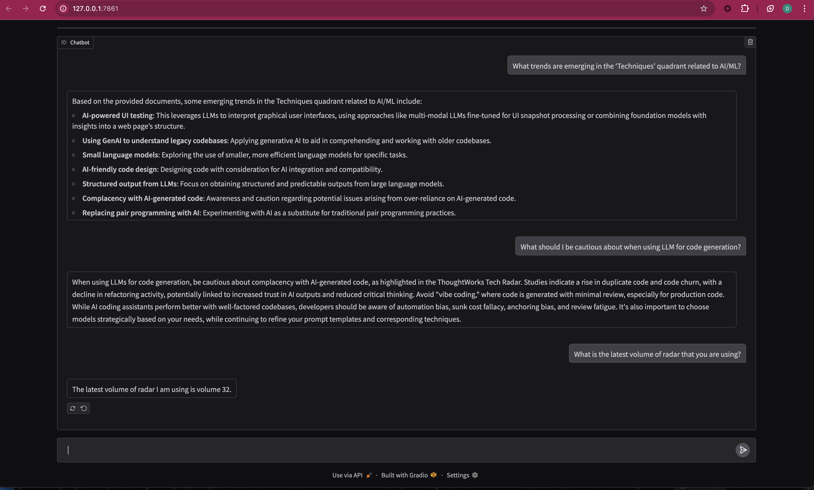

# Chat with ThoughtWorks Tech Radar



This Python project leverages Generative AI and RAG (Retrieval Augmented Generation) to enable searching through the ThoughtWorks Technology Radar. The Radar tracks various technologies and techniques, referred to as "blips", and this tool makes it easier to learn from and explore the Radar's content.

## Features

- **Chatbot Interface**: Built using Gradio for an intuitive user experience
- **Flexible LLM Support**: Configurable to use different language models:
  - Google AI
  - OpenAI
  - Ollama (for local execution)

## Installation

The project uses `uv` for Python package management. Follow these steps to set up your environment:

1. Install uv and set up virtual environment:
```bash
pip install uv
uv venv .venv
source .venv/bin/activate
```

2. Install project dependencies:
```bash
uv pip install -r pyproject.toml --all-extras
```

## Running the Application

### Environment Setup

Before running the application, you need to set up a `.env` file based on the provided templates. The templates contain a `model_name` variable which can be chosen from the list of `model_alias` values in `llm_config.py`.

#### OpenAI Setup
1. Copy the template:
```bash
cp .env.openai.template .env
```
2. Add your OpenAI API key to the `.env` file

#### Google Models Setup
1. Copy the template:
```bash
cp .env.google.template .env
```
2. Add your Google API key to the `.env` file

#### Ollama Local Setup
1. Copy the template:
```bash
cp .env.ollama.template .env
```
2. Install Ollama from [https://ollama.com/download/mac](https://ollama.com/download/mac)
3. Pull the required model:
```bash
ollama pull mistral-nemo
```
4. (Optional) Edit `llm-config.yaml` to change the default model

### Running the Application

1. First, ingest the data (required only once):
```bash
python -m src.scripts.db_management
```

2. Launch the application:
```bash
uv run main.py
```

This will launch a Gradio chat interface where you can interact with the ThoughtWorks Tech Radar through natural language queries.

**Note**: Make sure you have the appropriate API keys set up for your chosen model (Google, OpenAI, or Ollama configured locally).

## Project Structure

```
├── config/                 # Configuration files
├── data/                  # Tech Radar PDF documents
│   └── *.pdf             # ThoughtWorks Tech Radar PDF files
├── src/
│   ├── api/              # API endpoints
│   ├── data_ingestion/   # Data loading and processing
│   ├── llm/              # Language model integration
│   ├── scripts/          # Utility scripts
│   ├── utils/            # Helper utilities
│   └── vector_store/     # Vector database management
├── tests/                # Test files
└── examples/             # Usage examples
```
